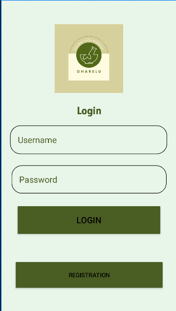
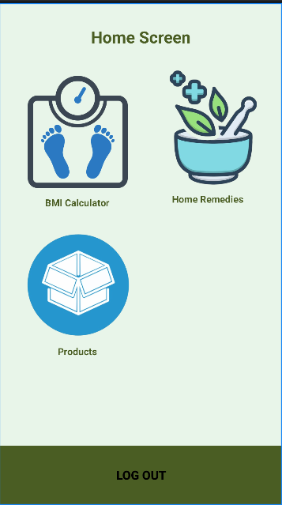
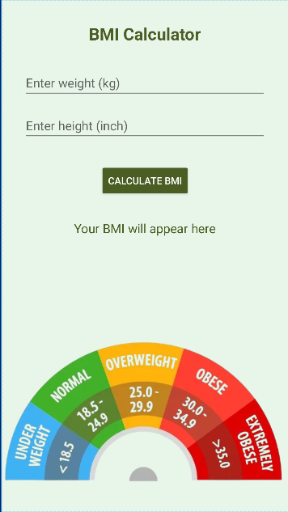

# 🏡 Gharelu - Home Remedies Android App

**Gharelu** Gharelu is an Android app offering natural home remedies, a BMI calculator, and wellness products. Built with Jetpack Compose and Figma UI, it provides a clean, intuitive user experience for users seeking simple, effective health solutions at home.

## ✨ Features

- 🩺 **Home Remedies** – Find trusted and natural remedies for everyday health issues.
- 📦 **Product Store** – Shop for herbal and natural products.
- ⚖️ **BMI Calculator** – Quickly check your Body Mass Index.
- 🔐 **Logout & Secure Navigation** – Easy logout and user flow.

## 🛠 Built With

- **Jetpack Compose** – Modern UI toolkit for native Android.
- **Kotlin (Can be adapted to Java XML)** – Built with Compose but includes XML version.
- **Android Studio** – Main IDE used for development.
- **Figma** – UI designed and adapted from Figma prototypes.

## 📱 Screenshots

| Main | Home Screen | Remedies | Products | BMI Calculator |
|------|-------------|----------|----------|----------------|
| | |  | |  |

## 🚀 Getting Started

### Prerequisites
- Android Studio Electric Eel or newer
- Android SDK 33+
- Gradle 8.0+

### Setup
```bash
git clone https://github.com/Chaitali2601/Gharelu-HomeRemediesApp.git
cd Gharelu-HomeRemediesApp
